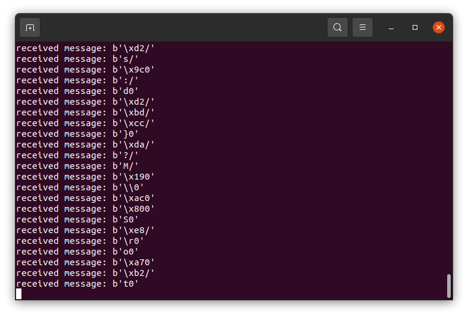

# Nucleo-H743ZI ADC + Ethernet Recipe

This project is a minimum working example to establish an Ethernet connection via LwIP (w/o RTOS) between the STM32H743 and a Python client for ADC sample data transmission.

- µC uses static IP address **192.168.0.10** (server)
- PC ethernet interface uses static IP address **192.168.0.11** (client)

## Build environments
1. Ubuntu - **CubeMX** & **gcc-arm-none-eabi** & **st-link**
2. Windows - **CubeMX** & **IAR Embedded Workbench**

### 1. Ubuntu
1.  set **IP / network mask**:
    1.  type `ifconfig` and locate Ethernet device name (e.g. `ens3`)
    2.  edit `$ nano /etc/netplan/01-netcfg.yaml`
        ```
        network:
        version: 2
        renderer: networkd
        ethernets:
            ens3:
            dhcp4: no
            addresses:
                - 192.168.0.11/24
            gateway4: 192.168.0.11
            nameservers:
                addresses: [8.8.8.8, 1.1.1.1]
        ```
    3. activate new IP settings via `$ sudo netplan apply` and validate with `$ ifconfig`
2. download and install **CubeMX** from [ST development tools site](https://www.st.com/en/development-tools/stm32cubemx.html)
3. install **gcc-arm-none-eabi**
    - `$ add-apt-repository ppa:team-gcc-arm-embedded/ppa`
    - `$ apt-get update`
    - `$ apt-get install gcc-arm-none-eabi`
4. download and install **st-link** from GitHub repository for STLINK/V3 support
    - `$ git clone`
    - `$ make clean && release && make install && make debug && make package`   ([see compile manual for details](https://github.com/stlink-org/stlink/blob/develop/doc/compiling.md))
    - `$ dpkg -i ./build/Release/dist/stlink_1.7.0-186-gc4762e6-1_amd64.deb`
    - `$ apt install ./build/Release/dist/stlink_1.7.0-186-gc4762e6-1_amd64.deb`
    - `$ st-info --probe` prints detected stlink devices if installed successfully
5. generate code, compile binary and flash µC
   1. open CubeMX and click **GENERATE CODE**
   2. `cd` into project directory (`./stm32h7_adc_eth`) and compile via `$ make all`
   3. `$ st-flash --reset write ./build/H743ZI_LwIP_ADC+ETH.bin 0x8000000` to flash the µC
6. print ADC data (noise) from µC sent via Ethernet
    ```
    $ python py_udp_receiver/udp_receiver.py
    ```


### 2. Windows
1. set **IP / network mask** for the PC as **192.168.0.11 / 255.255.255.0** (client)
2. connect **Nucleo-H743ZI** board to your PC using **Ethernet** cable
3. power up the **Nucleo-H743ZI** board (connect to USB port or use external 5V/3.3V)
4. open the project (./EWARM/Project.eww)
5. flash the binary file to the µC
6. open console, `cd` to the project directory `stm32h7_adc_eth` and type:
    ```
    python py_udp_receiver/udp_receiver.py
    ```
#### Result
Once the build and flash succeeded and UDP connection is established, the ADC sample words are displayed in the console.


#### If the build fails...
- validate RAM address range wich is supposed to be from 0x24000000 to 0x2401FFFF (see below)

