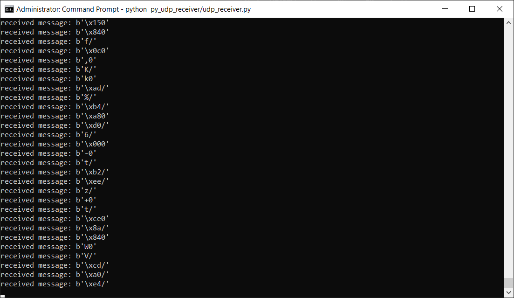
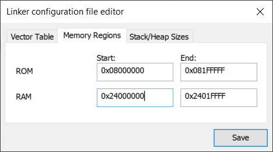

# Nucleo-H743ZI ADC + Ethernet Recipe

This project is a minimum working example to establish an Ethernet connection via LwIP (w/o RTOS) between the STM32H743 and a Python client for ADC sample data transmission.

- µC uses static IP address **192.168.1.10** (server)
- PC ethernet interface uses static IP address **192.168.1.11** (client)

## Build environments
- **IAR Embedded Workbench** (./EWARM/Project.eww)
- to come: **Eclipse** (SW4STM32) IDE

## Instructions
1. set **IP / network mask** for the PC as **192.168.1.11 / 255.255.255.0** (client)
2. connect **Nucleo-H743ZI** board to your PC using **Ethernet** cable
3. power up the **Nucleo-H743ZI** board (connect to USB port or use external 5V/3.3V)
4. open the project (./EWARM/Project.eww)
5. flash the binary file to the µC
6. open console, `cd` to the project directory `stm32h7_adc+eth` and type:

    ```
    python py_udp_receiver/udp_receiver.py
    ```
- optional: generate project from CubeMX file **H743ZI_LwIP_ADC+ETH.ioc** and start from 4.

## Result
Once the build and flash succeeded and UDP connection is established, the ADC sample words are displayed in the console.



## If the build fails...
- validate RAM address range wich is supposed to be from 0x24000000 to 0x2401FFFF (see below)

